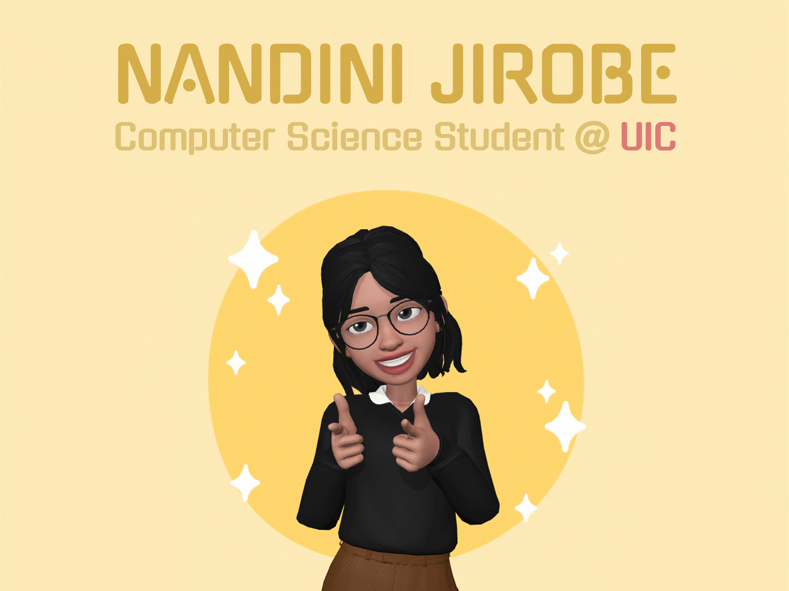

# 👋 Hi, I'm Nandini

🎓 Master’s student in Computer Science at UIC  
🧑‍🏫 TA for Python, Advanced Data Structures, and the Women in Engineering Summer Program  
🤖 Researcher at UIC’s NLP Lab, working on nonverbal behavior generation in robots  
👩‍🔬 VP of the Graduate Society of Women Engineers @ UIC  
🌱 Interests: Software Development, Robotics, Virtual Reality, Data Science  
🌍 Learn more about my skills and experiences on my [LinkedIn](https://www.linkedin.com/in/nandinijirobe/)!  
📧 Contact me at jirobenandini@gmail.com

<!---
- 🔭 I’m currently working on ...
- 🌱 I’m currently learning ...Machine Organization, Languages and Automata
 👯 I’m looking to collaborate on ...
- 🤔 I’m looking for help with ...
- 💬 Ask me about ...
- 📫 How to reach me: ...
- 😄 Pronouns: ...she/her
- ⚡ Fun fact: ... 
<!---

